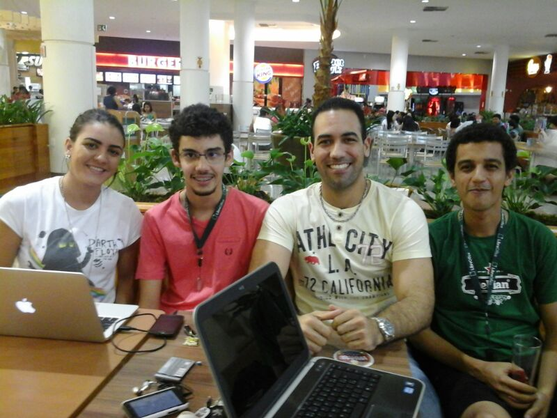
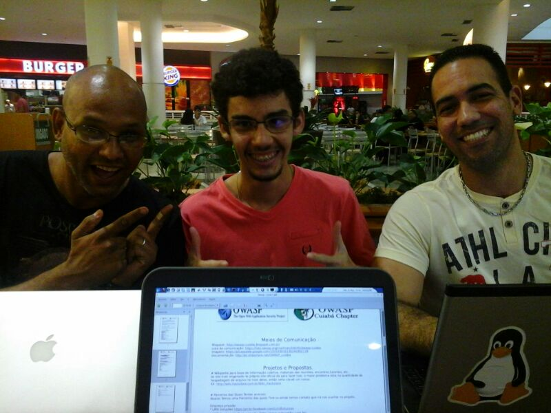

# 5º Encontro OWASP Cuiabá
### Sobre o Encontro
* __Local__: ~~SEPLAM~~ Shopping Pantanal - Praça da Alimentação
* __Horário__: A partir das 13:50

### Participantes
1. Kembolle Amilkar
2. Gabriel Pedro
3. Bruno Arruda
4. Ricardo Germano (estava presente no local, mas a esposa não o soltou)
5. Saron (chegou no finalzinho)

### Objetivos
* ~~Definir estrutura da comunidade.~~ (Concluido)

### Prós
* Conseguimos cumprir nossos objetivos.
* ~~Sim, Saron é uma mulher.~~

### Contra
* Na última hora o local que iria acontecer foi alterado.
* Faltou __internet__

### Fotos

